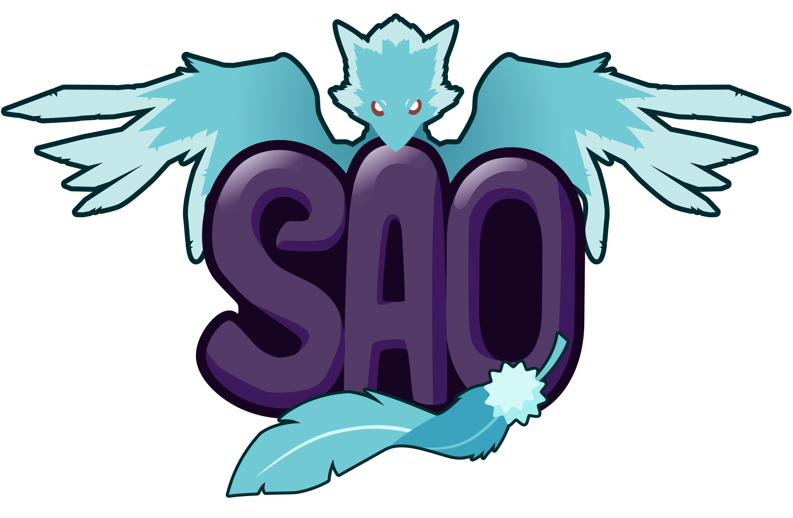

<p align="center"></p>

<h1 align="center">SAO Chronicles Launcher</h1>

<em><h5 align="center">Your gateway to the Sword Art Online world</h5></em>

<p align="center">Join the Sword Art Online adventure without worrying about installing Java, Forge, or other mods. We'll handle that for you.</p>

## Features

* 🔒 Full account management.
  * Add multiple accounts and easily switch between them.
  * Microsoft (OAuth 2.0) + Mojang (Yggdrasil) authentication fully supported.
  * Credentials are never stored and transmitted directly to Mojang.
* 📂 Efficient asset management.
  * Receive client updates as soon as we release them.
  * Files are validated before launch. Corrupt or incorrect files will be redownloaded.
* ☕ **Automatic Java validation.**
  * If you have an incompatible version of Java installed, we'll install the right one *for you*.
  * You do not need to have Java installed to run the launcher.
* 📰 News feed natively built into the launcher.
* ⚙️ Intuitive settings management, including a Java control panel.
* Full support for SAO Chronicles server.
  * Easily access all server features.
  * View the number of connected players.
* Automatic updates. The launcher updates itself.
* View the status of Mojang's services.

This is not an exhaustive list. Download and install the launcher to discover all it can do!

#### Like the project? Leave a ⭐ star on the repository!

## Downloads

You can download from [GitHub Releases](https://github.com/dscalzi/HeliosLauncher/releases)

**Supported Platforms**

If you download from the [Releases](https://github.com/dscalzi/HeliosLauncher/releases) tab, select the installer for your system.

| Platform | File |
| -------- | ---- |
| Windows x64 | `SAO-Chronicles-Launcher-setup-VERSION.exe` |
| macOS x64 | `SAO-Chronicles-Launcher-setup-VERSION-x64.dmg` |
| macOS arm64 | `SAO-Chronicles-Launcher-setup-VERSION-arm64.dmg` |
| Linux x64 | `SAO-Chronicles-Launcher-setup-VERSION.AppImage` |

## Console

To open the console, use the following keybind.

```console
ctrl + shift + i
```

Ensure that you have the console tab selected. Do not paste anything into the console unless you are 100% sure of what it will do. Pasting the wrong thing can expose sensitive information.

#### Export Output to a File

If you want to export the console output, simply right click anywhere on the console and click **Save as..**


## Development

This section details the setup of a basic development environment.

### Getting Started

**System Requirements**

* [Node.js][nodejs] v20

---

**Clone and Install Dependencies**

```console
> git clone https://github.com/remyshift/SAO_Chronicles_Launcher.git
> cd SAO_Chronicles_Launcher
> npm install
```

---

**Launch Application**

```console
> npm start
```

---

**Build Installers**

To build for your current platform.

```console
> npm run dist
```

Build for a specific platform.

| Platform    | Command              |
| ----------- | -------------------- |
| Windows x64 | `npm run dist:win`   |
| macOS       | `npm run dist:mac`   |
| Linux x64   | `npm run dist:linux` |

Builds for macOS may not work on Windows/Linux and vice-versa.

---

### Note on Third-Party Usage

Please give credit to the original author and provide a link to the original source. This is free software, please do at least this much.

For instructions on setting up Microsoft Authentication, see https://github.com/dscalzi/HeliosLauncher/blob/master/docs/MicrosoftAuth.md.

---

## Resources

* [Wiki][wiki]
* [Nebula (Create Distribution.json)][nebula]
* [v2 Rewrite Branch (Inactive)][v2branch]

The best way to contact the developers is on Discord.

[][discord]

---

### See you in-game.

[nodejs]: https://nodejs.org/en/ 'Node.js'
[vscode]: https://code.visualstudio.com/ 'Visual Studio Code'
[mainprocess]: https://electronjs.org/docs/tutorial/application-architecture#main-and-renderer-processes 'Main Process'
[rendererprocess]: https://electronjs.org/docs/tutorial/application-architecture#main-and-renderer-processes 'Renderer Process'
[chromedebugger]: https://marketplace.visualstudio.com/items?itemName=msjsdiag.debugger-for-chrome 'Debugger for Chrome'
[discord]: https://discord.gg/69yYyXUJ8Z 'Discord'
[wiki]: https://github.com/dscalzi/HeliosLauncher/wiki 'wiki'
[nebula]: https://github.com/dscalzi/Nebula 'dscalzi/Nebula'
